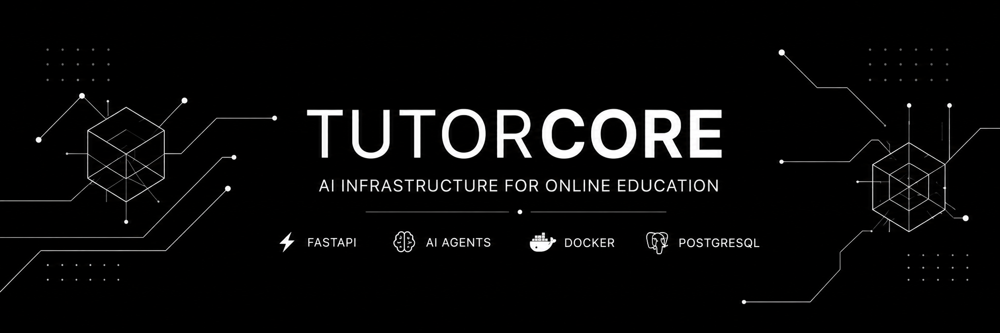

# Andrey Kalyachko

AI Developer | Backend Engineer | Founder of TutorCore

Building AI infrastructure for modern online education.

 

---

## About

Backend developer focused on scalable educational platforms, AI systems, and automation.

Currently developing TutorCore — a platform designed to integrate AI tutors, automated assessment, educational content generation, and learning analytics into online schools.

---

## Technology Stack

---

## Statistics

---

## Activity

---

## Current Focus

<table>
<tr>
<td width="50%">

### TutorCore

AI Infrastructure for Online Education

* AI Tutor Systems
* Homework Assessment Automation
* Educational Content Generation
* Learning Analytics
* LMS Integrations

</td>

<td width="50%">

### Research Areas

* LLM Applications
* AI Agents
* Retrieval-Augmented Generation
* Educational Technologies
* Production AI Systems

</td>
</tr>
</table>

---

## Featured Projects

| Project               | Description                                |
| --------------------- | ------------------------------------------ |
| TutorCore             | AI platform for online education           |
| ai-tutor-agent        | Educational AI assistant                   |
| education-api         | Backend services for educational platforms |
| telegram-learning-bot | Learning automation tools                  |
| homework-checker      | Automated homework assessment              |

---

## Contact

Telegram: @humiliatedpeep

VK: vk.com/asenje

Email: [505373@niuitmo.ru](mailto:505373@niuitmo.ru)

---

Building reliable AI products for education.

